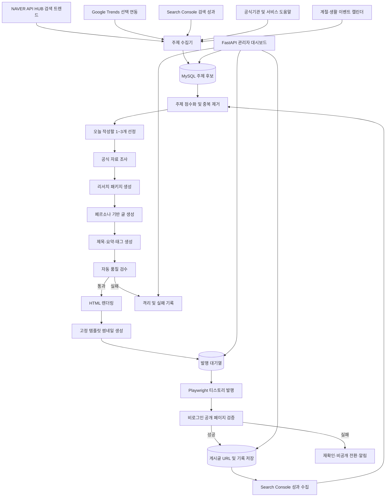
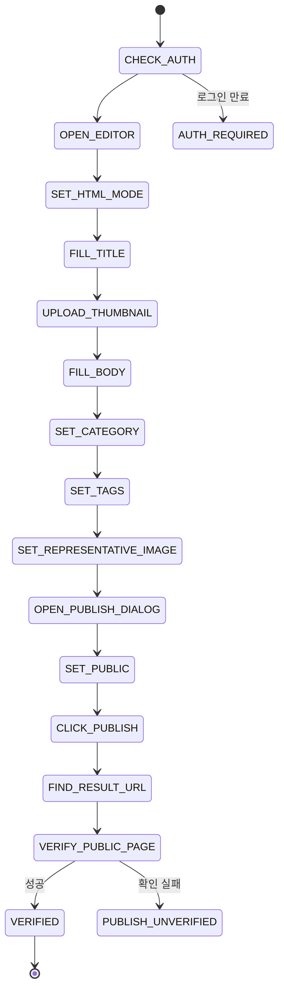
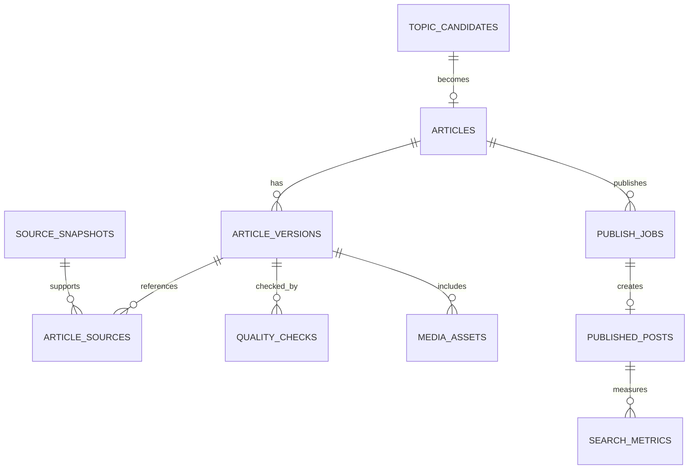

# 티스토리 생활꿀팁 자동화 최종 설계안

## 1. 최종 결론

이번 시스템은 다음 구조가 가장 적합합니다.

> **Python 모듈형 모놀리스 + MySQL 작업 큐 + 독립 워커 + Playwright 완전 자동 공개**

하루 1~3건 수준에서는 마이크로서비스, Redis, Kafka, Celery까지 넣을 이유가 없습니다. 처리량보다 중요한 것은 다음 세 가지입니다.

1. **조회 가능성이 높은 주제를 안정적으로 선별하는 것**
2. **품질 미달 글과 중복 글이 공개되지 않게 막는 것**
3. **티스토리 화면이 변경되어도 잘못된 버튼을 누르지 않게 하는 것**

따라서 하나의 Python 프로젝트를 사용하되, 실행 프로세스만 다음처럼 분리합니다.

| 프로세스               | 역할                             |
| ------------------ | ------------------------------ |
| `api`              | 관리자 대시보드와 설정 관리                |
| `scheduler`        | 매일 작업 생성과 발행 시간 관리             |
| `content-worker`   | 주제 선정, 자료 조사, 글 생성, 검수, 썸네일 생성 |
| `publisher-worker` | Playwright 티스토리 발행 전담          |
| `analytics-worker` | 검색 성과 수집과 주제 점수 개선             |

**운영자의 매번 승인 없이 자동 공개**하도록 하되, 자동 검수에 실패한 글은 공개하지 않고 격리합니다.

---

# 2. 전체 아키텍처



---

# 3. 권장 운영 방식

## 하루 발행 기준

```yaml
daily_min_posts: 1
daily_target_posts: 2
daily_max_posts: 3

publish_slots:
  - "08:30"
  - "13:30"
  - "19:30"

timezone: "Asia/Seoul"
ready_backlog_target: 14
ready_backlog_minimum: 7
```

발행 규칙은 다음과 같이 잡습니다.

| 준비된 글 수 | 발행 시간                           |
| ------: | ------------------------------- |
|      1개 | 오전 8시 30분                       |
|      2개 | 오전 8시 30분, 오후 7시 30분            |
|      3개 | 오전 8시 30분, 오후 1시 30분, 오후 7시 30분 |

시간은 설정 파일에서 변경할 수 있게 만들고 코드에 직접 넣지 않습니다.

## 반드시 준비 글을 쌓아둬야 하는 이유

매일 새벽에 만든 글을 그날 바로 공개하는 구조만 사용하면 다음 문제가 생깁니다.

* 검색 데이터 수집 실패
* 자료 출처 부족
* 생성 모델 오류
* 썸네일 생성 실패
* 티스토리 로그인 만료
* 티스토리 에디터 변경

따라서 **미리 자동 검수를 통과한 글을 최소 7개, 목표 14개 저장**해 둡니다. 오늘 생성이 실패해도 기존 대기 글에서 발행할 수 있습니다.

다만 준비 글까지 소진됐다면 품질 미달 글을 억지로 공개하지 않습니다. 하루 1건을 채우기 위해 저품질 글을 내보내는 구조는 장기적으로 블로그를 망칩니다.

---

# 4. 블로그 카테고리 최종 구성

블로그 전체 주제를 “생활 문제를 빠르게 해결하는 실용 가이드”로 통일하는 것이 좋습니다.

## 권장 카테고리

| 대분류        | 세부 주제                               |
| ---------- | ----------------------------------- |
| 생활 행정      | 정부24, 홈택스, 건강보험, 각종 증명서, 주민센터 업무    |
| 스마트폰·디지털   | 카카오톡, 문자, 사진, 파일 전송, 스마트폰 설정, 앱 사용법 |
| 생활비 절약     | 전기·가스·통신비, 구독 해지, 카드 명세서, 각종 할인     |
| 집안 관리      | 세탁, 청소, 보관, 냉장고, 가전제품 관리            |
| 계절 생활      | 장마, 폭염, 한파, 명절, 이사철, 연말정산 시기        |
| 생활 안전      | 보이스피싱, 스미싱, 중고거래, 개인정보, 분실 대처       |
| 병원·공공시설 이용 | 예약, 서류, 건강검진 절차 등 비의료적 이용방법         |

## 자동 작성에서 제외할 주제

```yaml
blocked_topics:
  - 질병 진단
  - 의약품 복용 변경
  - 영양제로 질환 치료
  - 투자 종목 추천
  - 대출 가능 여부 단정
  - 법적 책임에 대한 확정적 판단
  - 검증되지 않은 민간요법
  - 다른 블로그 글을 재구성한 콘텐츠
  - 출처 없는 정부지원금 정보
  - 공포심을 과도하게 유발하는 주제
```

생활꿀팁 블로그라고 하더라도 건강, 금융, 법률 영역으로 지나치게 들어가면 자동화 위험이 급격히 높아집니다.

---

# 5. 조회 가능성이 높은 주제를 찾는 구조

## 먼저 알아야 할 점

글을 발행하기 전에는 실제 클릭 수를 알 수 없습니다.

따라서 초기에는 다음 데이터를 통해 **예상 클릭 가능성**을 계산합니다.

* 검색 관심도
* 최근 검색 증가율
* 계절성
* 제목과 검색 의도의 일치도
* 경쟁 글의 부족한 부분
* 목표 독자와의 적합성

글이 쌓인 뒤에는 Search Console에서 실제 노출 수, 클릭 수, 검색어, 페이지별 성과를 가져와 주제 선정에 반영합니다. Search Console API는 검색어와 페이지 등을 기준으로 클릭·노출 데이터를 조회할 수 있습니다. ([Google for Developers][1])

## 주제 데이터 소스

### 1. NAVER API HUB

핵심 데이터 소스로 사용합니다.

* Search Trend API
* Search API
* 연령·기간별 검색 관심도
* 키워드별 변화량

주의할 점이 있습니다. 네이버 개발자센터의 Search API, Search Trend API 등은 NAVER API HUB로 이관 중입니다. **2026년 7월 31일 이후 신규 신청은 NAVER API HUB에서만 가능하며**, 기존 개발자센터 방식은 2027년 6월 30일 지원이 종료될 예정입니다. 따라서 처음부터 NAVER API HUB 기준으로 연동하는 것이 맞습니다. ([네이버 개발자][2])

### 2. Google Trends

연동 인터페이스는 만들어 두되 필수 의존성으로 두지는 않습니다.

2026년 7월 현재 공식 Google Trends API는 제한된 신청자를 대상으로 하는 알파 단계이므로, 접근 권한을 얻은 경우에만 자동 연동합니다. ([Google for Developers][3])

### 3. Google Search Console

블로그 운영 후 가장 중요한 데이터가 됩니다.

```text
검색어별 노출 수
검색어별 클릭 수
페이지별 클릭률
평균 검색 위치
모바일·PC별 성과
노출은 높지만 클릭이 낮은 검색어
검색 위치 8~30위에 있는 개선 가능 키워드
```

### 4. 계절·반복 이벤트

별도의 `seasonal_calendar` 테이블을 둡니다.

```text
1월: 연말정산, 자동차세 연납, 난방비
3월: 이사, 전입신고, 미세먼지
5월: 종합소득세, 가정의 달
6~7월: 장마, 에어컨, 전기요금
8월: 폭염, 냉장고 관리
9~10월: 명절, 환절기, 단풍
11~12월: 김장, 난방, 연말정산 준비
```

### 5. 공식 사이트 변경 사항

정부24, 홈택스, 통신사, 카드사, 제조사 도움말 등의 변경 내용을 정기적으로 확인합니다.

다른 블로그는 **제목과 검색 의도 파악용**으로만 참고하고, 본문 작성 근거로 사용하지 않는 것이 좋습니다.

---

# 6. 주제 점수 계산 방식

## 100점 기반 추천 공식

```text
주제 점수 =
검색 관심도                 25점
최근 상승률                 15점
목표 독자 적합도            15점
문제 해결 의도 명확성       15점
계절성·시의성               10점
기존 검색 결과의 정보 공백   10점
내부 링크 연결 가능성         5점
공식 출처 확보 가능성         5점
─────────────────────────────
총점                       100점
```

## 패널티

```text
기존 글과 의미 중복        -40점
최근 60일 내 유사 주제     -30점
공식 출처 부족             -40점
제목만 자극적이고 실용성 낮음 -30점
의료·법률·금융 위험 주제    -40점
검색 의도가 불명확          -20점
```

## 선정 조건

```yaml
minimum_topic_score: 70
minimum_source_count: 1
similar_topic_cooldown_days: 60
same_keyword_cooldown_days: 90
max_same_subcategory_per_day: 1
```

## 하루 3개 선정 예시

```text
08:30 생활행정
13:30 집안관리
19:30 스마트폰·디지털
```

같은 날 비슷한 글이 연속으로 나가지 않도록 카테고리를 분산합니다.

---

# 7. 추천 주제 선정 흐름


## 키워드가 아니라 “문제” 단위로 저장

단순히 `주민등록등본`이라고 저장하지 말고 다음처럼 구분합니다.

```text
주민등록등본 온라인 발급
주민등록등본 PDF 저장
주민등록등본 모바일 발급
주민등록등본 무인발급기 위치
주민등록등본 발급 수수료
주민등록초본과 등본 차이
```

DB에는 다음 정보를 저장합니다.

```json
{
  "canonical_topic": "주민등록등본 PDF 저장",
  "primary_keyword": "주민등록등본 pdf 저장",
  "search_intent": "HOW_TO",
  "category": "생활행정",
  "target_reader": "온라인 민원 서비스가 익숙하지 않은 사용자",
  "seasonality": "EVERGREEN",
  "risk_level": "LOW"
}
```

---

# 8. 글 생성 파이프라인

## 전체 순서

```text
주제 선정
→ 출처 수집
→ 사실과 절차 추출
→ 리서치 패키지 생성
→ 목차 생성
→ 본문 생성
→ 제목 후보 생성
→ 자동 편집
→ 품질 검수
→ HTML 변환
→ 썸네일 생성
→ 발행 대기
```

AI에게 검색 결과만 던지고 바로 글을 쓰게 하면 안 됩니다.

먼저 **구조화된 리서치 패키지**를 만든 뒤 그 데이터만 가지고 글을 쓰게 합니다.

## 리서치 패키지 예시

```json
{
  "topic_id": 1051,
  "title_intent": "정부24에서 주민등록등본을 PDF로 저장하는 방법",
  "target_reader": "PC 사용이 익숙하지 않은 50대 이상 사용자",
  "verified_at": "2026-07-27",
  "requirements": [
    "공동인증서 또는 간편인증",
    "정부24 계정"
  ],
  "facts": [
    {
      "claim": "온라인 발급 절차",
      "source_id": 201,
      "source_excerpt": "공식 안내 중 근거 문장",
      "confidence": 0.98
    }
  ],
  "steps": [
    {
      "order": 1,
      "action": "정부24에 접속합니다.",
      "button_name": null
    },
    {
      "order": 2,
      "action": "주민등록표 등본 발급을 검색합니다.",
      "button_name": "발급하기"
    }
  ],
  "warnings": [
    "공용 PC에서는 발급 파일을 반드시 삭제합니다."
  ],
  "unverified_items": []
}
```

`unverified_items`가 하나라도 남아 있으면 자동 공개하지 않습니다.

---

# 9. 기존 글 말투 분석 구조

말투와 품질 규칙은 분리합니다.

```text
configs/
├─ persona.md
├─ editorial_policy.md
├─ topic_taxonomy.yaml
├─ topic_scoring.yaml
├─ source_policy.yaml
├─ prohibited_phrases.yaml
├─ publishing_policy.yaml
├─ thumbnail.yaml
├─ tistory_selectors.yaml
│
├─ article_templates/
│  ├─ public_service.md
│  ├─ digital_howto.md
│  ├─ home_management.md
│  ├─ cost_saving.md
│  └─ seasonal_tip.md
│
└─ style_examples/
   ├─ example_001.md
   ├─ example_002.md
   └─ example_003.md
```

## 파일별 역할

| 파일                        | 역할                    |
| ------------------------- | --------------------- |
| `persona.md`              | 문체, 존댓말, 문장 길이, 표현 습관 |
| `editorial_policy.md`     | 출처, 정확성, 글 구성, 검수 기준  |
| `topic_taxonomy.yaml`     | 허용·금지 카테고리            |
| `topic_scoring.yaml`      | 주제 점수 가중치             |
| `source_policy.yaml`      | 출처 우선순위와 차단 도메인       |
| `prohibited_phrases.yaml` | 과장·클릭베이트·위험 표현        |
| `publishing_policy.yaml`  | 하루 발행량과 시간            |
| `thumbnail.yaml`          | 썸네일 크기와 글자 규칙         |
| `tistory_selectors.yaml`  | 티스토리 에디터 선택자          |
| `style_examples`          | 기존 글 중 대표적인 말투 예시     |

기존 글 전체를 매번 모델에 넣지 않고, 해당 카테고리와 비슷한 대표 글 2~4개만 가져와 참고시키는 구조가 효율적입니다.

---

# 10. 생활꿀팁 글의 기본 템플릿

어르신과 비숙련 사용자를 대상으로 한다면 다음 구조가 적합합니다.

```markdown
# 제목

> 확인 기준일: 2026년 7월 27일

## 먼저 결론부터

이 글에서 해결할 수 있는 내용을 2~3문장으로 설명합니다.

## 준비할 것

- 필요한 계정
- 인증수단
- 스마트폰 또는 PC
- 수수료
- 예상 소요시간

## 진행 방법

### 1. 첫 번째 단계

실제 메뉴명과 버튼명을 굵게 표시합니다.

### 2. 두 번째 단계

한 단계에 하나의 행동만 설명합니다.

## 잘 안 될 때 확인할 부분

오류 메시지와 해결방법을 설명합니다.

## 이용할 때 주의할 점

개인정보, 비용, 해지 조건 등을 설명합니다.

## 자주 묻는 질문

### 질문 1
답변

## 핵심 정리

중요한 내용 3개를 요약합니다.

## 참고한 공식 자료

공식 출처와 확인 날짜를 표기합니다.
```

## 글쓰기 규칙

```yaml
writing_rules:
  conclusion_first: true
  max_paragraph_sentences: 4
  use_actual_button_names: true
  separate_mobile_and_pc: true
  show_cost_and_duration: true
  use_tables_for_conditions: true
  explain_technical_terms: true
  show_verified_date: true
  maximum_heading_depth: 3
```

---

# 11. 제목 자동 생성 구조

한 개의 제목을 바로 생성하지 않고, 5개를 만든 후 점수를 계산합니다.

## 제목 평가 기준

```text
검색어 포함 여부               25점
검색 의도와 일치              25점
구체적인 결과 제시            20점
읽기 쉬움                     15점
과장 표현 없음                10점
기존 제목과 중복 없음          5점
```

## 좋은 제목 형태

```text
정부24 주민등록등본 PDF 저장 방법, 프린터 없이 발급하기

카카오톡 사진 한꺼번에 저장하는 방법, 휴대폰별로 정리했습니다

전기요금 자동이체 해지하는 방법, 앱과 전화 신청 차이

세탁기 고무패킹 곰팡이 청소 방법과 다시 생기지 않게 관리하는 법
```

## 차단할 제목

```text
이것 모르면 무조건 손해입니다
정부가 숨기고 있는 충격적인 사실
단 1분 만에 인생이 바뀝니다
아직도 이렇게 하세요?
100% 해결되는 방법
```

자동화로 많은 페이지를 만들더라도 독자에게 추가 가치를 제공하지 않으면 검색 스팸 정책 문제가 생길 수 있습니다. 검색량만 좇아 여러 주제를 대량 생성하지 말고, 블로그의 주제 집중도와 실제 문제 해결력을 유지해야 합니다. ([Google for Developers][4])

---

# 12. 자동 품질 검수

사람이 승인하지 않는 구조이므로 자동 검수 기준을 강하게 잡아야 합니다.

## 공개 차단 조건

다음 중 하나라도 발생하면 `QUARANTINED` 상태로 보냅니다.

```text
공식 출처가 없음
출처와 본문의 숫자가 다름
확인되지 않은 절차가 있음
필수 목차가 누락됨
금지 표현이 포함됨
기존 글과 지나치게 유사함
본문 링크가 깨짐
제목과 본문의 내용이 다름
HTML 구조가 깨짐
썸네일 글자가 잘림
카테고리 또는 태그가 없음
```

## 점수 기준

```yaml
quality_gate:
  minimum_total_score: 85
  minimum_source_coverage: 1.0
  maximum_duplicate_similarity: 0.82
  maximum_broken_links: 0
  maximum_unverified_claims: 0
  maximum_blocked_phrases: 0
```

## 검수 항목

| 검수기                      | 확인 내용                  |
| ------------------------ | ---------------------- |
| `SourceCoverageChecker`  | 중요한 주장에 출처가 연결됐는지      |
| `FactConsistencyChecker` | 출처와 숫자·날짜·절차가 일치하는지    |
| `DuplicateChecker`       | 기존 글과 의미가 중복되는지        |
| `TitleChecker`           | 제목과 본문이 일치하는지          |
| `ClickbaitChecker`       | 과장·공포·허위 긴급성을 사용했는지    |
| `ReadabilityChecker`     | 문장이 지나치게 길거나 어려운지      |
| `LinkChecker`            | 외부·내부 링크가 정상인지         |
| `HtmlValidator`          | 허용되지 않은 태그와 깨진 HTML 여부 |
| `ThumbnailValidator`     | 글자 잘림, 파일 생성, 크기 확인    |
| `PolicyChecker`          | 차단 주제와 금지 표현 확인        |

생성 모델과 검수 모델은 역할을 분리합니다.

```text
Writer 역할: 리서치 패키지로 글 작성
Reviewer 역할: 글에서 오류와 누락만 탐지
```

같은 모델을 사용하더라도 프롬프트와 작업 단계를 분리해야 합니다.

---

# 13. HTML 생성 방식

티스토리에는 최종적으로 **Markdown이 아니라 정제된 HTML**을 넣는 것을 권장합니다.

티스토리 공식 안내상 기본, Markdown, HTML 편집 모드가 있지만, 모드 전환 과정에서 문서 모양이 의도하지 않게 바뀔 수 있습니다. 자동 발행에서는 HTML을 직접 생성해 HTML 모드로 주입하는 편이 예측 가능성이 높습니다. ([TISTORY][5])

## 허용 HTML 태그

```yaml
allowed_tags:
  - h2
  - h3
  - p
  - strong
  - em
  - ul
  - ol
  - li
  - table
  - thead
  - tbody
  - tr
  - th
  - td
  - blockquote
  - a
  - img
  - br
  - hr
```

## 제거할 항목

```text
script 태그
iframe 태그
onclick 등 이벤트 속성
추적용 외부 스크립트
불필요한 인라인 스타일
숨김 텍스트
지원 여부를 확인하지 않은 구조화 데이터
```

---

# 14. 고정 썸네일 생성 구조

## 추천 방식

```text
HTML/CSS 템플릿
→ 제목 축약
→ 카테고리별 템플릿 데이터 삽입
→ Playwright로 캡처
→ 파일 검증
→ 티스토리 업로드
```

Pillow로도 가능하지만, HTML/CSS가 한글 줄바꿈과 글자 크기 조절을 관리하기 쉽습니다.

## 썸네일 규칙

```yaml
thumbnail:
  width: 1200
  height: 630
  format: "webp"
  fallback_format: "png"
  title_max_lines: 2
  title_max_characters: 28
  subtitle_max_characters: 24
  category_badge: true
  safe_area:
    x: 100
    y: 80
    width: 1000
    height: 470
```

## 구성

```text
┌───────────────────────────────────┐
│ [생활 행정]                       │
│                                   │
│ 주민등록등본                      │
│ PDF 저장하는 방법                 │
│                                   │
│ 준비물 · 수수료 · 인쇄방법         │
└───────────────────────────────────┘
```

## 카테고리별 요소

| 카테고리  | 시각 요소      |
| ----- | ---------- |
| 생활 행정 | 문서·체크 아이콘  |
| 스마트폰  | 스마트폰 아이콘   |
| 생활비   | 영수증·동전 아이콘 |
| 집안 관리 | 집·청소 아이콘   |
| 생활 안전 | 방패·경고 아이콘  |
| 계절 생활 | 날씨·달력 아이콘  |

생성형 배경 이미지를 매번 만들 필요는 없습니다. 아이콘과 색상, 제목만 바꾸는 편이 블로그 정체성을 만들기 좋습니다.

---

# 15. Playwright 티스토리 완전 자동 공개 구조

티스토리 Open API는 종료되어 외부 API를 통한 글 작성·수정·이미지 첨부가 불가능합니다. 따라서 Playwright로 에디터를 조작하는 방식이 현실적인 발행 경로입니다. ([TISTORY][6])

## 발행 단계



## 실제 발행 순서

1. 전용 브라우저 프로필 실행
2. 티스토리 로그인 상태 확인
3. 대상 블로그 확인
4. 글쓰기 에디터 진입
5. HTML 모드 전환
6. 제목 입력
7. 썸네일 업로드
8. 본문 HTML 입력
9. 카테고리 설정
10. 태그 입력
11. 대표 이미지 설정
12. 공개 설정
13. 발행 버튼 클릭
14. 게시글 URL 탐지
15. 별도 비로그인 브라우저로 공개 여부 확인
16. 제목·본문·대표 이미지 확인
17. 성공 기록 저장

---

# 16. 브라우저 세션 관리

## 전용 프로필 사용

일상적으로 사용하는 Chrome 프로필을 그대로 사용하면 안 됩니다.

```text
storage/
└─ browser_profiles/
   ├─ production/
   └─ test/
```

Playwright의 persistent context는 쿠키와 로컬 스토리지 같은 브라우저 세션 정보를 지정한 디렉터리에 저장할 수 있습니다. 같은 사용자 데이터 디렉터리를 여러 브라우저 인스턴스에서 동시에 실행하지 못하므로, 발행 워커는 반드시 동시 실행을 1개로 제한해야 합니다. ([Playwright][7])

## 로그인 만료 처리

```text
정상 로그인
→ 자동 발행

로그인 만료
→ AUTH_REQUIRED
→ 모든 발행 일시정지
→ 알림 전송
→ 운영자가 한 번 다시 로그인
→ 발행 재개
```

캡차, 추가 본인인증, 보안 확인을 자동 우회하려고 하면 안 됩니다. 정상 상황에서는 무인 운영하되, 계정 인증이 필요한 경우만 사람이 다시 로그인하는 방식이 현실적입니다.

---

# 17. 티스토리 선택자 관리

선택자를 코드 곳곳에 넣지 않고 설정 파일 하나에 모읍니다.

```yaml
tistory:
  editor:
    title:
      preferred:
        strategy: "placeholder"
        value: "제목을 입력하세요"
      fallback:
        strategy: "css"
        value: "textarea[placeholder*='제목']"

    publish_button:
      preferred:
        strategy: "role"
        role: "button"
        name: "완료"
      fallback:
        strategy: "text"
        value: "완료"

    html_mode:
      preferred:
        strategy: "text"
        value: "HTML"
```

Playwright는 역할, 라벨, 보이는 텍스트와 같은 사용자 중심 locator를 우선 사용하도록 권장하며, 긴 CSS·XPath 경로는 DOM 변경에 취약합니다. 또한 클릭 전 요소의 표시·안정·활성 상태 등을 자동으로 기다립니다. ([Playwright][8])

## 선택자 우선순위

```text
1. get_by_role()
2. get_by_label()
3. get_by_placeholder()
4. get_by_text()
5. 안정적인 속성
6. 짧은 CSS 선택자
7. XPath는 최후 수단
```

---

# 18. 오발행 방지 장치

완전 자동 공개에서 가장 중요한 부분입니다.

## 1. 발행 전 확인

```text
제목이 비어 있지 않은가
본문이 최소 요구 구조를 갖췄는가
썸네일 파일이 존재하는가
카테고리가 선택됐는가
이미 발행된 콘텐츠가 아닌가
오늘 최대 발행량을 넘지 않았는가
현재 블로그가 올바른 계정인가
```

## 2. 중복 발행 차단

각 글에 고유한 콘텐츠 해시를 저장합니다.

```text
content_hash =
SHA-256(
  정규화한 제목
  + 정규화한 본문
  + 대표 키워드
)
```

발행 전에 다음을 확인합니다.

```text
MySQL에 같은 content_hash가 있는지
최근 발행 목록에 같은 제목이 있는지
같은 publish_job이 이미 성공했는지
```

## 3. 발행 클릭 후 타임아웃 처리

발행 버튼을 눌렀는데 응답이 늦어졌다고 바로 다시 누르면 중복 글이 생길 수 있습니다.

```text
발행 클릭
→ 응답 타임아웃
→ 재클릭 금지
→ 최근 글 목록에서 정확한 제목 검색
→ 발견되면 성공 처리
→ 발견되지 않은 경우에만 제한적으로 재시도
```

## 4. 비로그인 검증

발행이 끝난 뒤 인증 정보가 없는 새 브라우저 컨텍스트로 게시글 URL을 엽니다.

다음 항목을 확인합니다.

```text
페이지 접속 성공
제목 일치
본문 핵심 문구 존재
대표 이미지 존재
비공개 또는 보호글이 아님
오류 페이지가 아님
```

---

# 19. UI 변경 감지와 자동 중단

Playwright 자동화는 티스토리 UI가 변경되면 잘못 작동할 수 있습니다.

따라서 매일 발행 전에 **에디터 상태 점검 작업**을 실행합니다.

```text
글쓰기 페이지 접속
제목 입력칸 확인
편집 모드 메뉴 확인
이미지 업로드 버튼 확인
완료 버튼 확인
발행 설정창 확인
```

하나라도 찾지 못하면 다음처럼 처리합니다.

```text
publisher_status = UI_BROKEN
AUTO_PUBLISH_ENABLED = false
남은 발행 작업 = 일시정지
스크린샷과 Playwright trace 저장
운영자에게 알림
```

셀렉터 오류가 발생했는데도 좌표 클릭이나 임의의 `nth()`로 계속 진행하면 다른 버튼을 누를 수 있습니다. **선택자를 못 찾으면 발행하지 않는 것이 정답**입니다.

---

# 20. 작업 스케줄러와 큐

## 권장 구성

* APScheduler: 정해진 시간에 작업을 MySQL에 등록
* MySQL `jobs` 테이블: 실제 작업 대기열
* Worker: 작업을 가져와 처리
* Publisher Worker: 발행 작업만 단독 처리

2026년 7월 기준 APScheduler의 안정 버전 계열은 3.11이며, 4.0은 여전히 알파 릴리스입니다. 따라서 초기 구축에서는 **APScheduler 3.11.3을 고정해서 사용**하는 편이 안전합니다. ([PyPI][9])

## 스케줄러가 직접 작업하지 않는 이유

스케줄러가 글 생성과 발행을 모두 직접 실행하면 긴 작업 하나 때문에 다음 일정이 밀릴 수 있습니다.

따라서 스케줄러는 다음만 담당합니다.

```text
지금 실행할 job을 MySQL에 등록
오늘 발행 슬롯 생성
실패 job의 재실행 시간 계산
```

실제 처리는 워커가 담당합니다.

---

# 21. 작업 큐 테이블

```sql
jobs
├─ id
├─ job_type
├─ entity_id
├─ payload_json
├─ status
├─ priority
├─ run_after
├─ attempt_count
├─ max_attempts
├─ locked_by
├─ locked_at
├─ started_at
├─ finished_at
├─ last_error_code
├─ last_error_message
├─ created_at
└─ updated_at
```

## 작업 종류

```text
COLLECT_TRENDS
DISCOVER_TOPICS
SCORE_TOPICS
BUILD_RESEARCH_PACK
GENERATE_ARTICLE
RUN_QUALITY_CHECK
GENERATE_THUMBNAIL
SCHEDULE_PUBLISH
PUBLISH_TISTORY
VERIFY_PUBLISHED_POST
COLLECT_SEARCH_METRICS
REFRESH_OLD_ARTICLE
```

## 우선순위 예시

| 작업          | 우선순위 |
| ----------- | ---: |
| 발행 후 검증     |  100 |
| 티스토리 발행     |   90 |
| 오늘 필요한 글 생성 |   80 |
| 오류 재처리      |   70 |
| 트렌드 수집      |   50 |
| 장기 통계 수집    |   30 |

---

# 22. 작업 상태

```text
PENDING
→ RUNNING
→ SUCCEEDED

PENDING
→ RUNNING
→ RETRY_WAIT
→ RUNNING
→ SUCCEEDED

PENDING
→ RUNNING
→ FAILED

PENDING
→ CANCELLED
```

게시글 상태는 별도로 관리합니다.

```text
DISCOVERED
→ SCORED
→ SELECTED
→ RESEARCHED
→ DRAFTED
→ QA_PASSED
→ HTML_READY
→ THUMBNAIL_READY
→ READY_TO_PUBLISH
→ SCHEDULED
→ PUBLISHING
→ PUBLISHED
→ VERIFIED
```

예외 상태:

```text
QA_FAILED
QUARANTINED
AUTH_REQUIRED
UI_BROKEN
PUBLISH_UNVERIFIED
ROLLBACK_REQUIRED
ARCHIVED
```

---

# 23. 핵심 MySQL 테이블

신규 구축이라면 안정성 중심의 MySQL 8.4 LTS 계열이 적합합니다. MySQL은 8.4를 장기 지원 트랙으로 제공하고 있습니다. ([MySQL Developer Zone][10])

## 테이블 구성

| 테이블                 | 역할              |
| ------------------- | --------------- |
| `topic_seeds`       | 기본 생활 키워드 사전    |
| `topic_candidates`  | 수집된 주제 후보       |
| `trend_snapshots`   | 날짜별 검색 관심도      |
| `seasonal_events`   | 계절·행정 일정        |
| `source_documents`  | 공식 자료 원문        |
| `source_snapshots`  | 수집 시점별 원문 버전    |
| `research_packs`    | 글 생성용 근거 데이터    |
| `articles`          | 게시글의 현재 상태      |
| `article_versions`  | 글 생성·수정 버전      |
| `article_sources`   | 글과 출처 연결        |
| `quality_checks`    | 검수 항목별 결과       |
| `media_assets`      | 썸네일과 이미지        |
| `publish_slots`     | 날짜별 발행 시간       |
| `publish_jobs`      | 티스토리 발행 작업      |
| `published_posts`   | 실제 URL과 발행 결과   |
| `search_metrics`    | 클릭·노출·CTR·검색 위치 |
| `jobs`              | 전체 작업 큐         |
| `job_runs`          | 작업 실행 이력        |
| `prompt_versions`   | 사용한 프롬프트 버전     |
| `selector_versions` | 티스토리 선택자 버전     |
| `system_settings`   | 운영 설정           |
| `system_events`     | 장애·알림·상태 변경 기록  |

## 주요 관계



---

# 24. 프로젝트 폴더 구조

```text
tistory-life-automation/
├─ app/
│  ├─ api/
│  │  ├─ routes/
│  │  │  ├─ dashboard.py
│  │  │  ├─ topics.py
│  │  │  ├─ articles.py
│  │  │  ├─ publishing.py
│  │  │  ├─ failures.py
│  │  │  └─ settings.py
│  │  ├─ templates/
│  │  └─ static/
│  │
│  ├─ core/
│  │  ├─ config.py
│  │  ├─ logging.py
│  │  ├─ exceptions.py
│  │  ├─ security.py
│  │  ├─ clock.py
│  │  └─ constants.py
│  │
│  ├─ db/
│  │  ├─ base.py
│  │  ├─ session.py
│  │  ├─ models/
│  │  └─ repositories/
│  │
│  ├─ collectors/
│  │  ├─ base.py
│  │  ├─ naver_api_hub.py
│  │  ├─ google_search_console.py
│  │  ├─ google_trends.py
│  │  ├─ official_sites.py
│  │  └─ seasonal_calendar.py
│  │
│  ├─ topics/
│  │  ├─ discovery.py
│  │  ├─ keyword_expansion.py
│  │  ├─ intent_classifier.py
│  │  ├─ scoring.py
│  │  ├─ deduplication.py
│  │  ├─ selector.py
│  │  └─ category_balancer.py
│  │
│  ├─ research/
│  │  ├─ source_retriever.py
│  │  ├─ source_snapshot.py
│  │  ├─ fact_extractor.py
│  │  ├─ step_extractor.py
│  │  └─ pack_builder.py
│  │
│  ├─ generation/
│  │  ├─ provider.py
│  │  ├─ prompt_loader.py
│  │  ├─ outline_generator.py
│  │  ├─ article_generator.py
│  │  ├─ title_generator.py
│  │  ├─ summary_generator.py
│  │  ├─ tag_generator.py
│  │  └─ html_renderer.py
│  │
│  ├─ quality/
│  │  ├─ pipeline.py
│  │  ├─ source_coverage.py
│  │  ├─ fact_consistency.py
│  │  ├─ duplicate_check.py
│  │  ├─ title_check.py
│  │  ├─ clickbait_check.py
│  │  ├─ readability.py
│  │  ├─ link_check.py
│  │  ├─ policy_check.py
│  │  └─ html_validator.py
│  │
│  ├─ media/
│  │  ├─ title_compactor.py
│  │  ├─ thumbnail_renderer.py
│  │  ├─ thumbnail_validator.py
│  │  └─ alt_text.py
│  │
│  ├─ publishing/
│  │  ├─ base.py
│  │  └─ tistory/
│  │     ├─ browser.py
│  │     ├─ authentication.py
│  │     ├─ editor.py
│  │     ├─ media_uploader.py
│  │     ├─ publish_dialog.py
│  │     ├─ duplicate_guard.py
│  │     ├─ verifier.py
│  │     ├─ rollback.py
│  │     ├─ selector_registry.py
│  │     └─ health_check.py
│  │
│  ├─ jobs/
│  │  ├─ scheduler.py
│  │  ├─ queue.py
│  │  ├─ worker.py
│  │  ├─ locks.py
│  │  ├─ retry_policy.py
│  │  └─ handlers/
│  │
│  ├─ analytics/
│  │  ├─ search_console.py
│  │  ├─ performance_score.py
│  │  ├─ opportunity_detector.py
│  │  └─ topic_feedback.py
│  │
│  └─ notifications/
│     ├─ base.py
│     ├─ email.py
│     └─ desktop.py
│
├─ configs/
│  ├─ persona.md
│  ├─ editorial_policy.md
│  ├─ topic_taxonomy.yaml
│  ├─ topic_scoring.yaml
│  ├─ source_policy.yaml
│  ├─ prohibited_phrases.yaml
│  ├─ publishing_policy.yaml
│  ├─ thumbnail.yaml
│  ├─ tistory_selectors.yaml
│  └─ article_templates/
│
├─ templates/
│  ├─ thumbnails/
│  │  ├─ public_service.html
│  │  ├─ digital.html
│  │  ├─ home.html
│  │  ├─ saving.html
│  │  └─ safety.html
│  └─ article/
│
├─ entrypoints/
│  ├─ run_api.py
│  ├─ run_scheduler.py
│  ├─ run_content_worker.py
│  ├─ run_publisher_worker.py
│  └─ run_analytics_worker.py
│
├─ storage/
│  ├─ sources/
│  ├─ articles/
│  ├─ thumbnails/
│  ├─ screenshots/
│  ├─ traces/
│  ├─ browser_profiles/
│  │  ├─ production/
│  │  └─ test/
│  └─ backups/
│
├─ migrations/
├─ tests/
│  ├─ unit/
│  ├─ integration/
│  ├─ publishing/
│  └─ fixtures/
│
├─ scripts/
│  ├─ initial_login.py
│  ├─ check_tistory_ui.py
│  ├─ publish_test_post.py
│  ├─ backup_database.py
│  └─ restore_database.py
│
├─ .env
├─ .env.example
├─ pyproject.toml
├─ requirements.lock
├─ alembic.ini
└─ README.md
```

---

# 25. 권장 기술 스택

| 영역       | 권장 기술                            |
| -------- | -------------------------------- |
| 언어       | Python                           |
| 관리자 API  | FastAPI                          |
| 관리자 화면   | Jinja2 + HTMX                    |
| ORM      | SQLAlchemy 2.x                   |
| 마이그레이션   | Alembic                          |
| 데이터베이스   | MySQL 8.4 LTS                    |
| 스케줄러     | APScheduler 3.11.3               |
| 브라우저 자동화 | Playwright Python                |
| HTTP 수집  | HTTPX                            |
| HTML 분석  | BeautifulSoup 또는 selectolax      |
| 설정 관리    | Pydantic Settings                |
| 데이터 검증   | Pydantic                         |
| HTML 정제  | Bleach 또는 자체 whitelist           |
| 썸네일      | HTML/CSS + Playwright Screenshot |
| 유사도 검사   | 초기 TF-IDF, 추후 임베딩                |
| 템플릿      | Jinja2                           |
| 테스트      | pytest                           |
| 로그       | Python logging + JSON 로그         |
| 배포       | 로컬 프로세스 또는 시스템 서비스               |

SQLAlchemy는 각 작업 단위마다 세션과 트랜잭션을 열고 성공 시 커밋, 실패 시 롤백하는 구조로 사용합니다. ([SQLAlchemy Documentation][11])

## 이번 단계에서 제외할 기술

```text
Redis
Celery
Kafka
Kubernetes
Elasticsearch
별도 벡터 데이터베이스
복잡한 프론트엔드 프레임워크
```

하루 1~3건 자동화에는 불필요합니다. 데이터량과 작업량이 크게 늘어난 후 추가해도 늦지 않습니다.

---

# 26. 재시도와 장애 처리

| 장애           | 처리                     |
| ------------ | ---------------------- |
| 외부 API 일시 오류 | 지수 백오프로 최대 3회 재시도      |
| LLM 응답 형식 오류 | JSON 복구 1회, 재생성 1회     |
| 출처 부족        | 재시도하지 않고 격리            |
| 링크 오류        | 다른 공식 출처 탐색 후 재검수      |
| 썸네일 글자 잘림    | 폰트 크기 축소 후 재생성         |
| 티스토리 로그인 만료  | 발행 정지, `AUTH_REQUIRED` |
| 캡차·추가 인증     | 자동 우회 금지, 발행 정지        |
| 에디터 선택자 불일치  | 전체 발행 중단, `UI_BROKEN`  |
| 발행 응답 타임아웃   | 최근 글 검색 후 중복 여부 확인     |
| 공개 페이지 검증 실패 | 한 번 재확인 후 비공개 전환       |
| DB 오류        | 트랜잭션 롤백 후 재시도          |
| 하루 최대량 초과    | 다음 날로 이동               |

## 재시도 설정

```yaml
retry_policy:
  network:
    max_attempts: 3
    delays_seconds: [30, 120, 600]

  llm_format:
    max_attempts: 2

  publish:
    max_attempts: 2
    verify_before_retry: true

  selector_error:
    max_attempts: 0

  authentication_error:
    max_attempts: 0
```

선택자 오류와 인증 오류는 반복 실행해도 해결되지 않으므로 자동 재시도하지 않습니다.

---

# 27. 관리자 대시보드

완전 자동 공개여도 관리 화면은 필요합니다. 승인용이 아니라 감시와 장애 복구용입니다.

## 메인 화면

```text
오늘 발행 예정: 2개
오늘 발행 완료: 1개
발행 준비 글: 12개
격리된 글: 3개
티스토리 로그인: 정상
에디터 UI 상태: 정상
마지막 성공 발행: 2026-07-27 08:31
```

## 주요 메뉴

### 주제 후보

* 키워드
* 카테고리
* 점수
* 검색 추세
* 선정 또는 보류 이유

### 콘텐츠 파이프라인

* 현재 단계
* 품질 점수
* 실패한 검수 항목
* 사용한 출처
* 썸네일 미리보기

### 발행 현황

* 예정 시간
* 현재 상태
* 재시도 횟수
* 발행 URL
* 검증 결과

### 시스템 상태

* 티스토리 로그인 상태
* 에디터 선택자 상태
* API 사용량
* 워커 상태
* 최근 오류
* 준비 글 수

## 관리 버튼

```text
전체 자동 발행 중지
자동 발행 재개
현재 작업 취소
발행 재시도
게시글 비공개 전환
글 다시 생성
썸네일 다시 생성
티스토리 로그인 창 열기
UI 상태 검사
```

---

# 28. 분석과 개선 구조

## 초기 60일

검색 성과 데이터가 부족하므로 다음 기준으로 주제를 선택합니다.

```text
검색 트렌드
계절성
검색 의도
공식 출처
기존 글과의 차별성
목표 독자 적합도
```

## 데이터 축적 후

Search Console 데이터로 다음을 계산합니다.

```text
주제별 평균 노출
주제별 평균 클릭
카테고리별 CTR
제목 패턴별 CTR
모바일과 PC 성과 차이
검색 위치 8~30위의 개선 가능 글
계절별 성과
발행 후 성과가 나타나는 평균 기간
```

## 성과 피드백

```text
성과가 좋은 카테고리
→ 주제 점수 가중치 상승

노출은 높지만 클릭이 낮은 제목 패턴
→ 제목 점수 하락

클릭은 높지만 체류가 낮은 유형
→ 본문 품질 검수 강화

검색 위치 8~30위
→ 후속 글 또는 기존 글 보강 후보
```

초기에는 제목 자동 수정까지 하지 않는 것이 좋습니다. 데이터가 충분히 쌓인 뒤 별도 기능으로 추가해야 원인과 결과를 구분할 수 있습니다.

---

# 29. 보안과 운영 기준

## 필수 보안

```text
API 키는 .env에 저장
티스토리 쿠키는 전용 브라우저 프로필에만 저장
브라우저 프로필 디렉터리 접근 권한 제한
로그에 비밀번호·쿠키·API 키 기록 금지
로그인 화면 캡처 금지
DB root 계정으로 애플리케이션 실행 금지
운영 DB 매일 백업
```

## 발행 중단 스위치

```env
AUTO_PUBLISH_ENABLED=true
MAX_DAILY_POSTS=3
TISTORY_PRODUCTION_ENABLED=true
```

장애 시 DB나 관리자 화면에서 즉시 `AUTO_PUBLISH_ENABLED=false`로 바꿀 수 있어야 합니다.

## 패키지 업데이트

Playwright는 패키지 버전과 대응 브라우저 바이너리를 함께 관리하므로, 자동으로 최신 버전으로 올리지 않는 것이 좋습니다. 업데이트 시 테스트 블로그에서 먼저 검증하고 브라우저 설치도 다시 수행해야 합니다. ([Playwright][12])

---

# 30. 테스트 전략

## 단위 테스트

```text
주제 점수 계산
중복 주제 판정
제목 점수 계산
금지 표현 탐지
HTML 정제
썸네일 제목 축약
발행 슬롯 결정
콘텐츠 해시 생성
```

## 통합 테스트

```text
MySQL 작업 큐
출처 수집 → 리서치 패키지
리서치 패키지 → 글 생성
글 → 품질 검수
글 → HTML → 썸네일
```

## Playwright 테스트

운영 블로그가 아니라 별도 테스트 블로그를 사용합니다.

```text
에디터 열기
HTML 모드 전환
테스트 제목 입력
이미지 업로드
본문 입력
카테고리 설정
비공개 테스트 발행
공개 테스트 발행
공개 URL 확인
테스트 글 삭제 또는 비공개 전환
```

## 운영 전 통과 기준

```text
7일 이상 연속 자동 실행
중복 발행 0건
잘못된 블로그 발행 0건
품질 미달 글 공개 0건
발행 후 URL 검증 성공률 100%
로그인 만료 시 안전 정지
UI 변경 시 안전 정지
하루 최대 3건 제한 정상 작동
```

---

# 31. 단계별 구현 순서

## 1단계: 기반 구성

* 프로젝트 폴더
* FastAPI
* MySQL
* SQLAlchemy
* Alembic
* 환경설정
* 로그
* 작업 큐

## 2단계: 주제 시스템

* 생활 키워드 사전
* NAVER API HUB 연동
* 계절 캘린더
* 주제 점수
* 중복 제거
* 하루 1~3개 선정

## 3단계: 자료 조사와 글 생성

* 공식 출처 수집
* 리서치 패키지
* `persona.md`
* 카테고리별 템플릿
* 제목·본문·태그 생성

## 4단계: 자동 품질 검수

* 출처 검수
* 중복 검사
* 금지 표현
* 링크 검사
* HTML 검사
* 품질 점수

## 5단계: 썸네일

* HTML/CSS 템플릿
* 카테고리별 디자인
* 자동 줄바꿈
* 글자 잘림 검사
* WebP 또는 PNG 출력

## 6단계: 테스트 블로그 발행

* 전용 브라우저 프로필
* 로그인 유지
* HTML 모드 입력
* 이미지 업로드
* 공개 발행
* 공개 URL 검증
* 실패 복구

## 7단계: 완전 자동 운영

* 발행 슬롯
* 준비 글 버퍼
* 워커 자동 실행
* 장애 알림
* 발행 중단 스위치

## 8단계: 검색 성과 개선

* Search Console 연동
* 카테고리별 성과
* 주제 점수 피드백
* 노출 대비 클릭률 분석

---

# 32. 최종 운영 설정 권장값

```yaml
application:
  timezone: "Asia/Seoul"
  environment: "production"

publishing:
  enabled: true
  daily_min: 1
  daily_target: 2
  daily_max: 3
  slots:
    - "08:30"
    - "13:30"
    - "19:30"
  publisher_concurrency: 1

backlog:
  minimum_ready_articles: 7
  target_ready_articles: 14
  maximum_ready_articles: 30

topics:
  minimum_score: 70
  same_keyword_cooldown_days: 90
  similar_topic_cooldown_days: 60
  max_same_subcategory_per_day: 1

quality:
  minimum_score: 85
  require_official_source: true
  allow_unverified_claims: false
  allow_broken_links: false
  maximum_duplicate_similarity: 0.82

playwright:
  persistent_profile: true
  headless: false
  production_profile_path: "./storage/browser_profiles/production"
  test_profile_path: "./storage/browser_profiles/test"
  save_screenshots_on_failure: true
  save_trace_on_failure: true
  stop_on_selector_error: true
  stop_on_authentication_error: true

scheduler:
  discovery_time: "01:30"
  generation_time: "02:30"
  analytics_time: "23:30"

storage:
  retain_source_snapshots_days: 365
  retain_failure_screenshots_days: 90
  retain_playwright_traces_days: 30
```

---

# 최종 요약

최종 구조는 다음과 같습니다.

```text
NAVER API HUB·Search Console·계절 데이터
→ 생활꿀팁 주제 후보 수집
→ 클릭 가능성 점수화
→ 하루 1~3개 선정
→ 공식 자료 수집
→ 리서치 패키지 생성
→ 기존 블로그 페르소나로 글 작성
→ 자동 사실·중복·정책 검수
→ HTML 렌더링
→ 고정 템플릿 썸네일 생성
→ 준비 글 대기열 저장
→ 정해진 시간에 Playwright 공개 발행
→ 비로그인 공개 페이지 검증
→ Search Console 성과 수집
→ 다음 주제 점수에 반영
```

핵심 설계 결정은 네 가지입니다.

1. **한 프로젝트 안에서 모듈을 분리하고 실행 프로세스만 나눕니다.**
2. **하루 1~3건을 맞추기 위해 최소 7개 이상의 검수 완료 글을 비축합니다.**
3. **Playwright가 선택자·로그인·검증 단계에서 이상을 발견하면 공개하지 않고 멈춥니다.**
4. **검색량만 높은 글이 아니라, 공식 출처가 있고 실제 문제를 해결하는 생활꿀팁만 발행합니다.**

이 구조를 최종 기준으로 잡고, 구현은 **MySQL DDL → Python 프로젝트 스캐폴딩 → 작업 큐 → 주제 선정 → 글 생성 → 썸네일 → 티스토리 발행기** 순서로 진행하는 것이 가장 안전합니다.

[1]: https://developers.google.com/webmaster-tools/v1/searchanalytics/query?utm_source=chatgpt.com "Search Analytics: query  |  Search Console API  |  Google for Developers"
[2]: https://developers.naver.com/notice/article/32530 "[중요] Search API, Search Trend, Shopping Insight 서비스 종료 및 NAVER API HUB 이관 안내 - 공지사항"
[3]: https://developers.google.com/search/apis/trends?utm_source=chatgpt.com "Google Trends API Alpha | Google Search Central  |  Documentation  |  Google for Developers"
[4]: https://developers.google.com/search/docs/fundamentals/creating-helpful-content?utm_source=chatgpt.com "Creating Helpful, Reliable, People-First Content | Google Search Central  |  Documentation  |  Google for Developers"
[5]: https://notice.tistory.com/2482 "마크다운, HTML모드 사용하기"
[6]: https://notice.tistory.com/2664 "[안내] 티스토리 Open API가 종료됩니다."
[7]: https://playwright.dev/python/docs/api/class-browsertype "BrowserType | Playwright Python"
[8]: https://playwright.dev/python/docs/locators?utm_source=chatgpt.com "Locators | Playwright Python"
[9]: https://pypi.org/project/APScheduler/?utm_source=chatgpt.com "APScheduler · PyPI"
[10]: https://dev.mysql.com/doc/refman/8.4/en/mysql-releases.html?utm_source=chatgpt.com "MySQL :: MySQL 8.4 Reference Manual :: 1.3 MySQL Releases: Innovation and LTS"
[11]: https://docs.sqlalchemy.org/en/20/orm/session_basics.html?utm_source=chatgpt.com "Session Basics — SQLAlchemy 2.0 Documentation"
[12]: https://playwright.dev/python/docs/browsers?utm_source=chatgpt.com "Browsers | Playwright Python"
